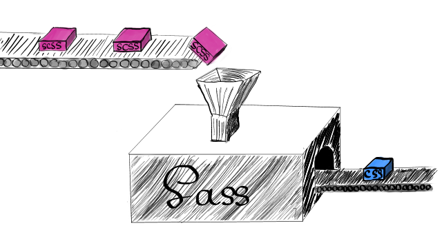
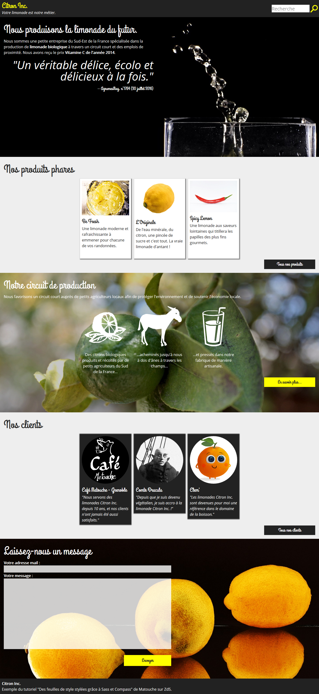
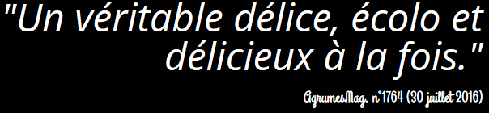
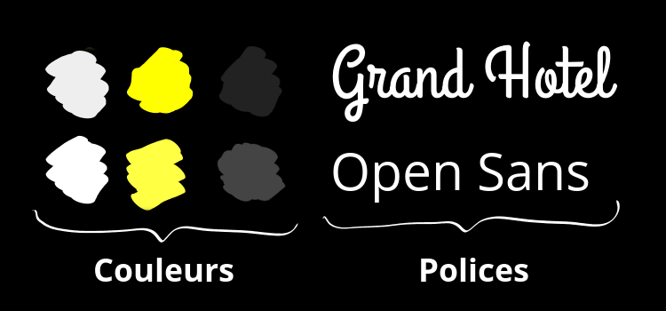

# Sass, de la magie dans vos feuilles de styles
**Apprenez à mieux organiser vos feuilles de styles avec Sass**  
Lorsqu’on découvre comment sont faits les sites Web, on est souvent étonné
de voir que le contenu (HTML) est clairement séparé de la mise en page (CSS).
Et puis, assez vite, on ne peut plus s’en passer. C’est tellement pratique ! Mais
au bout d’un moment, nos fichiers CSS deviennent très longs, très très longs, et
on ne s’y retrouve plus. Alors, comment **mieux organiser son code**, comment le rendre
**plus maintenable** ?
#### En utilisant Sass, pardi !


Ce tutoriel s'adresse à toute personne très à l'aise avec HTML et CSS qui cherche un moyen de mieux gérer ses feuilles de styles.

[[attention]]
| Je ne suis en aucun cas un développeur front-end professionnel (disons plutôt un amateur très enthousiaste au sujet de Sass). Il est fort probable que quelques bourdes se soient glissées dans ce tutoriel. Si tel est le cas, pensez à me le signaler et je ferai mon possible pour les corriger.

## Sass, un préprocesseur CSS
Au départ ce n'était qu'un petit jardin bien entretenu. Et puis, peu à peu, la forêt s'est densifiée, les règles se sont multipliées, la jungle s'est installée. Vos feuilles de styles sont devenues surchargées et illisibles. Vous êtes un jeune aventurier et vous avez peur de de vous lancer dans cette périlleuse expédition ? Il y a encore peu de temps, on vous aurait répondu de vous débrouiller. Mais aujourd'hui, une solution existe.

Un véritable produit miracle, un héro du vingt-et-unième siècle, une chimère devenue réalité ! On appelle cela… un préprocesseur CSS.

[[question]]
| Mais, c'est quoi un préprocesseur CSS ?  

C'est tout le sujet de ce chapitre, ami lecteur…

### Un préprocesseur CSS
Commençons par regarder sur Wikipédia, qui nous donne une définition générale bien obscure…

> En informatique, un préprocesseur est un programme qui procède à
> des transformations sur un code source, avant l’étape de traduction
> proprement dite (compilation ou interprétation).
Source: Wikipédia

Essayons d'expliquer cela de manière plus simple. Un préprocesseur est un programme jouant le rôle d’une
moulinette : on lui donne du code source et, en échange, il génère un code modifié.
Dans le cas d’un préprocesseur CSS comme Sass, on donne des fichiers écrits dans un langage spécifique à Sass et la moulinette génère des feuilles de style CSS qui pourront être comprises par un navigateur. On appelle ce processus **la compilation**.



Ce langage spécifique est le *SCSS* (pour « Sassy CSS »). On retrouve dans ce nom les lettres CSS, car la syntaxe du langage SCSS se base sur celle de CSS. En fait, tout code CSS est compatible SCSS. Cela veut dire que tout travail en CSS est directement transposable en SCSS. Il suffit pour cela de changer l'extension du fichier pour `.scss`.

### À quoi ça sert ?
Si le SCSS à une syntaxe basée sur celle de CSS, on peut se demander l'intérêt de Sass. En fait, Sass ajoute à CSS un ensemble de fonctionnalités qui permettent d'organiser de manière plus maintenable les feuilles de style. Sa devise pourrait être "Don't Repeat Yourself" (ne vous répétez pas). Il ne s'agit donc pas de rajouter des propriétés, mais d'aider le développeur à y voir plus clair, à défricher son code (d'où la métaphore de la forêt vierge, CQFD). Dans ce but, Sass permet de factoriser certains bouts de code, stocker les couleurs/polices/dimensions fréquement utilisées en un unique endroit, rendre certaines règles plus facilement réutilisables d'un projet à l'autre.

Comme tout est plus simple avec un exemple, je vous propose comme fil rouge à ce cours le site Web de *Citron Inc*, une petite entreprise spécialisée dans la production de limonades biologiques. Parce que oui, j'ai de l'imagination :



On remarque plusieurs choses :

* Les mêmes couleurs (jaune, gris foncé, etc.) et les mêmes polices sont utilisées pour plusieurs éléments.
* Les "cartes" représentant un produit du catalogue, une étape de fabrication ou un client partagent quelques propriétés. Il serait utile de "factoriser" toutes ces propriétés, pour que le fichier de travail soit moins long, sans pour autant qu'on perde en lisibilité.
* Les boutons ont la plupart de leurs propriétés en commun (dimension et police, notament), mais pas toutes (les couleurs sont différentes). De plus, on peut facilement imaginer que des boutons similaires soient présents sur d'autres projets, et il serait fatigant de réinventer la roue à chaque fois.

Cet exemple mis à part, certains problèmes d'organisation reviennent fréquemment dans de nombreux projets :

* Séparer les styles en plusieurs fichiers permet de mieux s'organiser en préprod, et facilite le recyclage de portions de code, mais demande plus de requêtes, donc plus de ressources en production.
* En CSS il es fréquent de répéter plusieurs fois les mêmes sélecteurs. Dans notre exemple, on va ainsi cibler l'élément `header`, puis `header h1`, et enfin `header p`. À grande échelle, c'est plutôt barbant…

Vous l'aurez compris, Sass propose une solution à tous les problèmes que je vient de citer n ajouter de nouveaux mots à la syntaxe CSS. Ces nouveaux mots facilitent la vie du codeur, mais sont parfaitement invisibles à un visiteur du site Web : celui-ci continuera à recevoir un feuille de style CSS qui aura été générée par Sass.

### Installation
Vous n'en pouvez plus attendre d'avoir Sass sur votre machine ? Avant tout, chers lecteurs, il faut que vous disposiez d'un interpréteur Ruby. Ruby est le langage de programmation utilisé par les développeurs de Sass. Pour obtenir l'interpréteur Ruby, tout dépend du système d'exploitation.

+ Sous Linux, il est fort probable que votre distribution fournisse Ruby par défaut. Sinon, il est disponible dans les dépots officiels et s'installe via un gestionnaire de paquets (`dnf`, `apt`, `pacman`, etc.).
+ Sous macOS, vous pouvez sauter cette étape : Ruby est installé par défaut.
+ Sous Windows, vous pouvez télécharger l'installateur depuis [le site officiel](http://rubyinstaller.org/downloads/). Durant l'installation, pensez à cocher la case "Add Ruby executables to your PATH".

Maintenant, nous pouvons installer Sass avec `gem`. Gem est le gestionnaire de paquets de Ruby. Si c'est votre première utilisation de la ligne de commande, jeunes padawans, pas de panique : c'est d'une simplicité déconcertante. Lancez un terminal (sous Windows, vous pouvez utiliser l'invite de commande `cmd`) et entrez : `gem install sass` (attention à ne pas oublier `sudo` sur les sysèmes Unix).

[[erreur]]
| Si Windows n'arrive pas à trouver gem, c'est peut-être que vous n'avez pas coché durant l'installation de Ruby la case "Add Ruby executables to your PATH".

Ça y est, c'est fini ! Vous pouvez vérifier que sass est bien installé en tapant `sass -v` dans un terminal : si vous obtenez le numéro de version de Sass, c'est que tout s'est bien passé.

###Notre projet fil rouge
Revenons à notre fil rouge : le site de limonade. Je vais vous fournir son code comme exemple tout au long de ce cours. Nous partirons donc d'un gros fichier CSS (et de la page HTML qui va avec) et nous allons chercher à le rendre le plus lisible, compréhensible et maintenable possible avec l'aide de Sass. Cela vous permettra de voir progressivement comment vous pouvez vous faciliter la vie avec Sass, ainsi que d'adopter quelques reflexes.

 Vous pouvez récupérer l'ensemble du code de notre fil rouge sur [Github](https://github.com/Matouche/CitronInc).

À l'intérieur du répertoire CitronInc, vous pouvez voir notre page Web, le dossier *sass* qui sera notre dossier de travail pour les fichiers SCSS et un dossier *stylesheets* pour les fichiers CSS générés. Il est habituellement préférable de séparer les fichiers SCSS des fichiers CSS si on veut s'y retrouver un minimum. J'ai déjà placé dans le dossier sass un fichier `main.scss` qui contient exclusivement du code CSS. Nous verrons étape par étape comment Sass nous permet de rendre ce code plus maintenable. Il y a aussi un fichier `main.css` dans le dossier *stylesheets* c'est le fichier CSS compilé par Sass. Pour l'instant, comme `main.scss` ne contient aucune commande spécifique à Sass, les deux fichiers sont strictement identiques.

Vous remarquerez au passage un dossier `img` qui contient des… images (je sais, c'était dûr à deviner), et le dossier correction qui contient les corrections des exercices que je vous proposerait en fin de chapitres.

Voilà, nous sommes prêts à commencer ! Si vous préférez démarrer directement avec l'un de vos projets actuels plutôt que de prendre mon exemple, n'hésitez pas : vous ne devriez pas avoir trop de mal à appliquer ce que je vais vous montrer sur un autre code.

### La compilation
Maintenant que le dossier de notre projet est prêt, voyons comment compiler une première fois notre feuille de style, c'est-à-dire générer  *stylesheets/main.css* à partir de *sass/main.scss*.

Tout d'abord, placez-vous à l'intérieur du dossier *CitronInc* en ligne de commande. Utilisez pour cela la commande `cd` (si vous êtes familiers de celle-ci) ou bien, dans l'explorateur de fichier de Windows, faites un Clic-Droit avec la touche Maj enfoncée et choisissez "Ouvrir une fenêtre de commande ici".

La commande pour indiquer à Sass de compiler tous les fichiers SCSS est `sass --watch`. Elle s'utilise ainsi :

    sass --watch sass:stylesheets

Comme vous pouvez le voir, elle prend deux paramètres, séparés par `:` : le nom d'un fichier/dossier d'entrée et celui d'un fichier/dossier de sortie. Si tout se passe bien, vous devrier voir ceci s'afficher :

    >>> Sass is watching for changes. Press Ctrl-C to stop.
        write stylesheets/main.css
        write stylesheets/main.css.map

Sass nous indique qu'il est désormais en train de **surveiller** les changements dans le dossier *sass* : chaque fois que l'on modifiera un fichier SCSS, les fichiers CSS correspondants seront régénérés de manière transparente. Ainsi toute modification est directement visible dans le navigateur (et ceci d'autant plus rapidement si vous utilisez des extensions comme LiveReload). Par ailleurs, Sass nous dit qu'il vient de recompiler notre fichier *main.css*, et de créer un fichier *main.css.map*. Ce dernier est utile pour afficher le fichier SCSS original directement dans les outils de développement de votre navigateur (généralement accessibles via F12). Cela permet par exemple de sélectionner un élément dans la page et de voir les règles SCSS qui s'appliquent à ce dernier.

### En résumé
* Sass est un **préprocesseur CSS**, c’est-à-dire qu’il génère du CSS à partir de
fichiers `.scss` ;
* Utiliser un préprocesseur CSS permet d’**optimiser son code** et de moins se
répéter ;
* La syntaxe par défaut de Sass est le **SCSS** et tout code CSS est compatible avec cette syntaxe.
* La commande `sass --watch input:output` indique à Sass qu'il doit **recompiler automatiquement** les fichiers `.scss` du dossier input à chaque modification et placer les fichiers CSS générés dans le dossier output.

Voilà, nous arrivons à la fin de ce premier chapitre, j'espère qu'il vous a plu. Dans  le prochain chapitre, nous nous intéresserons à un premier concept clef de Sass, l'imbrication de règles.

## L'imbrication
Pour commencer en douceur, on va s'intéresser dans ce chapitre à l'*imbrication de règles*, une fonctionnalité fondamentale de Sass. Comme vous aller le voir, elle s'inscrit vraiment dans le principe « Don't Repeat Yourself ».

### L'imbrication, pourquoi faire ?
Commençons par observer cet extrait de notre feuille de style :

```css
blockquote{
    font-style: italic;
}
blockquote:before, blockquote:after{
    content: '"';
}
.quote{
    text-align: right;
    margin: 1rem 0;
}
.quote blockquote{
    font-size: 3rem;
    line-height: 1em;
}
.quote figcaption{
    font-family: "Grand Hotel", serif;
    font-size : 1.2rem;
    margin-top: 1rem;
}
.quote figcaption:before{
    content: '\2012  ';
}
```

On remarque que `blockquote`, `.quote` et `figcaption` sont répétés plusieurs fois. Ce n'est pas encore trop rébarbatif à cette échelle là, mais ça l'est au niveau de la feuille de style en entier : on n'a pas forcément envie de répéter plusieurs fois les mêmes sélecteurs. Avec Sass, les règles concernant `.quote` peuvent être écrites de la manière suivante en utilisant l'imbrication de règles :

```scss
.quote{
    text-align: right;
    margin: 1rem 0;
    blockquote{
        font-size: 3rem;
        line-height: 1em;
    }
    figcaption{
        font-family: "Grand Hotel", serif;
        font-size : 1.2rem;
        margin-top: 1rem;
    }
    figcaption:before{
        content: '\2012  ';
    }
}
```    

Avec l'imbrication, nous n'avons écrit `.quote` qu'une seule fois et nous avons mis les blocs `blockquote`, `figcaption` et `figcaption:before` *à l'intérieur* du bloc `.quote`. Sass comprend lors de la compilation que les règles ne doivent concerner que les éléments `<blockquote>` et `<figcaption>` situées à l'intérieur d'une élément de classe `.quote`. On obtient bien la même chose qu'avec le code précédent. Cependant, vous remarquez que l'on a regroupé toutes les règles concernant un module (la citation) dans un même bloc. Ainsi, le code est plus lisible, car il est mieux *organisé*.



On peut aussi imbriquer des propriétés CSS. Cela peut être utile pour regrouper les propriétés d'une même catégorie à l'intérieur d'un bloc. Par exemple, nous pouvons mettre dans un même bloc les propriétés `font-size` et `font-family`, comme ceci (faites bien attention au deux-points après `font`) :

```scss
figcaption{
    font: {
        family: "Grand Hotel", serif;
        size: 1.2rem;
    }
    margin-top: 1rem;
}
```

Voilà pour le principe de base de l'imbrication. Passons maintenant à quelques cas particuliers.

### Cas particuliers
#### La référence au parent
On n'a pas encore réussi à imbriquer le sélecteur `figcaption:before`. Vous pensez que le code suivant marchera ?

```scss hl_lines="7"
figcaption{
    font: {
        family: "Grand Hotel", serif;
        size: 1.2rem;
    }
    margin-top: 1rem;
    :before{
        content: '\2012  ';
    }
}
```

En réalité, on obtiendra le sélecteur `figcaption :before` (avec une espace) qui ne veut rien dire. Pour corriger cela, on va utiliser le sélecteur `&`, qui *fait référence au parent*. Ainsi, ce code fonctionnera :

```scss hl_lines="7"
figcaption{
    font: {
        family: "Grand Hotel", serif;
        size: 1.2rem;
    }
    margin-top: 1rem;
    &:before{
        content: '\2012  ';
    }
}
```

Que s'est-il passé ? Avec le sélecteur `&` (l'esperluette), on a indiqué à Sass où il devait insérer le sélecteur du bloc parent. Dans notre cas, comme il n'y a pas d'espace entre `&` et `:before`, il n'y en aura pas après compilation entre `figcaption`et le pseudo-élément.

On peut faire de même avec `blockquote` :

```scss
blockquote{
    font-style: italic;
    &:before, &:after{
        content: '"';
    }
}
```

Il est aussi possible de s'en servir avec une *pseudo-classe* (`&:hover` sélectionne l'élément parent au survol) ou même à la fin d'un sélecteur (`section &` sélectionne l'élément parent lorsqu'il est contenu dans une balise `<section>`). Toujours moins de répétitions, et toujours plus d'imbrications qui rendent le code plus lisible. :)

#### Les media-queries
Depuis quelque temps et la démocratisation du Responsive Web Design (RWD pour les intimes), les media-queries ont le vent en poupe. Justement, saviez-vous que Sass permet d'imbriquer la directive `@media` ? Interessons-nous à cet extrait de notre exemple :

```scss hl_lines="4"
#description{
    max-width:22rem;
}
@media all and (min-width: 740px){
    #description{
        max-width:48%;
    }
}
```

Il est possible d'imbriquer le bloc `@media` à l'intérieur du bloc `#description`. L'intérêt est encore un gain de clarté, puisque l'on regroupe toutes les règles concernant un module (`#description`) dans un même bloc :

```scss hl_lines="3"
#description{
    max-width:22rem;
    @media all and (min-width: 740px){
        max-width:48%;
    }
}
```

Voilà, pas grand chose d'autre à dire là-dessus, même si on reparlera un peu des media-queries dans le prochain chapitre.

### Bonne pratique : *The Inception Rule*

L'imbrication est un outil puissant, mais cela ne veut pas dire qu'il faut en abuser, au risque de provoquer une pagaille inimaginable. Vous pourriez être tentés de reproduire dans la feuille de style la structure de la page HTML, un peu comme ceci :

```scss
html{
    ...
    body{
        ...
        header{
            #hgroup{
                ...
                h1{...}
                h2{...}
            }
            #search{
                ...
                input{...}
                button{
                ...
                    &::after{...}
                }
            }
        }
        #presentation{...}
    }
}
```

Sauf que… **c'est mal !** Essayez d'imaginer quels sélecteurs seront présents après la compilation :

```css
html body header #hgroup #search button::after{
    ...
}
```


Beurk. Une telle méthode pose deux problèmes. Le premier, c'est que l'on perd en partie le principe de la cascade : les sélecteurs sont trop spécifiques, et une modification, même peu importante, du HTML risque d'imposer une modification de la feuille de style. On a donc perdu en maintenabilité. :( Le second, c'est que, tout bêtement, le fichier `.css` sera inutilement lourd, ce qui est embêtant pour le serveur comme pour les visiteurs.

C'est là qu'intervient ce que l'on appelle *« The Inception Rule »*. La règle est la suivante : *n'imbriquez pas plus de quatre niveaux différents*. C'est une règle arbitraire et contraignante, mais je vous invite à la suivre. Si vous dépassez quatre niveaux, c'est que probablement l'un d'entre eux n'est pas nécessaire. Essayez donc de ne pas trop allonger vos sélecteurs. Il y a souvent moyen de faire plus court.


### En résumé
 * On peut éviter d'écrire plusieurs fois les mêmes sélecteurs, grâce à l'**imbrication**.
 * Lors de l'imbrication, pour **faire référence au bloc parent**, on utilise le sélecteur `&`.
 * On peut **imbriquer la directive `@media`** pour mieux organiser son code.
 * Il ne vaut mieux pas dépasser **quatre niveaux d'imbrication**, c'est *The Inception Rule*.

### Pour s'entraîner
Je vous invite à trouver tous les endroits où il est possible d'utiliser l'imbrication dans notre exemple, plu particulièrement en ce qui concerne l'élément `#search`, qui regroupe vraiment tout ce que nous venons de voir (esperluette et media-queries compris). La correction est [ici](https://github.com/Matouche/CitronInc/blob/master/corrections/imbrication.scss).


Dans le prochain chapitre, nous ferons un sort aux variables, de petites bestioles bien pratiques, héritées des langages de programmation.

## Les variables
Dans ce chapitre, nous allons aborder un autre aspect fondamental de Sass, les variables.

###Les variables, pourquoi faire ?
Vous avez sans doute remarqué que, dans un design, certaines valeurs reviennent souvent. Si on observe de près notre fil rouge, on peut retrouver plusieurs fois les mêmes couleurs et polices :



Maintenant, imaginez que vous souhaitez changer une de ces valeurs. Vous devez alors effectuer un rechercher-remplacer dans toute votre feuille de style. Mais il y a bien plus simple, vous pouvez utiliser une **variable** !

Une variable, c'est un peu comme une enveloppe. On stocke à l'intérieur une valeur (par exemple, la couleur `#ff0`) et on met une étiquette dessus (c'est le nom de la variable). Ensuite, lorsqu'on a besoin de la valeur de la variable, on a juste à donner son nom, et Sass ira lui-même chercher la valeur à notre place.


Comment allons-nous dire à Sass qu'il doit mettre la valeur `#ff0` dans la variable `$color` ? Ce n'est pas très compliqué, en fait, il suffit d'insérer le code suivant au début de notre feuille de style :

```scss
//A insérer au-début de main.scss
$color : #ff0;
```

On dit qu'on a *déclaré* une variable. Le nom de la variable commence nécessairement par `$`. Il est suivi de `:` puis de la valeur que l'on veut donner à notre variable.

Vous remarquez que j'ai écris dans le code un *commentaire* précédé par `//`. C'est un commentaire d'une ligne, spécifique à Sass, qui n'apparaitra pas dans le fichier CSS compilé.

Maintenant, on peut utiliser notre variable dans le reste du code, par exemple pour le titre principal :

```scss hl_lines="4"
#hgroup{
    float: left;
    h1{
        color: $color;
        font-size: 2em;
        line-height: 1em;
    }
    ...
}
```

À la compilation, Sass va remplacer le nom `$color` par la valeur `#ff0`. On peut aussi utiliser `$color` pour l'arrière-plan des boutons (`#production .more, #contact button`). Désormais, si on ajoute un élément qui utilise cette couleur, on pourra faire appel à notre variable.

Imaginons maintenant que notre client producteur de boissons gazeuses décide de changer la charte graphique : on va prendre du vert, ça fait plus bio ! Il suffit pour cela de changer la valeur de `$color` :

```scss
$color : #af0;
```


Vous l'aurez compris, l'intérêt des variables est avant tout de rassembler au même endroit les valeurs (couleurs, polices, etc.) qui reviennent dans notre feuille de style, afin de faciliter leur modification : plus besoin de parcourir l'ensemble du code à la recherche de chaque occurrence, tout est stocké dans une sorte de palette au début du fichier.

Voilà donc pour l'utilisation basique des variables avec Sass, voyons maintenant plus en détail tout ce que l'on peut mettre dedans.

### Les différents types de données
Il existe quatre principaux types de données que l'on peut stocker à l'intérieur d'une variable : les couleurs, les nombres, les chaînes de caractères et les listes.

Nous avons déjà vu comment cela fonctionnait pour **les couleurs**. Elles peuvent être nommées (par exemple `yellow`), ou écrites sous une forme hexadécimale (`#ff0`, `#ffff00`), mais aussi en RGB (`rgb(255,255,0)`) ou RGBA (`rgba(255,255,0,0.5)`), voire même en HSL/HSLA.

*[HSL]: Hue Saturation Light (Teinte Saturation Lumière)
*[HSLA]: Hue Saturation Light Alpha (Teinte Saturation Lumière Alpha)

Passons maintenant aux **nombres**. Les nombres peuvent ne pas avoir d'unité (par exemple `255`) ou en avoir une (par exemple `1em` ou `16px`). On peut s'en servir pour contenir la fonte des caractères (leur taille), la largeur ou la hauteur d'un bloc, la dimensions des marges, etc. Très clairement, je ne vois pas d'exemple intéressant dans notre fil rouge, mais ce n'est pas bien compliqué à imaginer :

```scss
//Exemple bidon
$largeur: 800px;
body{
  width: $largeur;
}
```

On peut effectuer des calculs avec les nombres : addition `+`, soustraction `-`, multiplication `*`, division `/` et modulo `%` (reste de la division euclidienne). Cela pourra être utile plus tard, mais pour l'instant, je vous offre un autre exemple sorti de nulle part :

```scss hl_lines="2 4 5"
//Autre exemple bidon
$var: 15px;
p{
  font-size: $var + 5px; // = 20px
  width: $var * (5+5) - 50px; // = 100px
}
```

[[information]]
| Petite précision concernant la division. Si vous écrivez juste `font-size: 40px/2;`, Sass n'effectuera pas la division (il laissera ce code dans le CSS). Pour qu'il fasse le calcul, vous devez ajouter des parenthèses : `font-size: (40px/2);`. Ce problème ne se pose pas si vous utilisez des variables (`$var/2`) dans la division, ou si le calcul est composé de plusieurs opérations (`40px/2 + 5px;`).

Pour votre culture, sachez que Sass permet aussi d'effectuer des opérations sur les couleurs, mais on s'en sert assez peu dans la pratique. Nous verrons plus tard que pour modifier une couleur, il existe des *fonctions* spécialisées.

Après cette parenthèse, passons au troisième type : **les chaines de caractères** (le texte). On peut stocker beaucoup de chose dans une chaîne de caractères : une police, une URL, ou n'importe quelle valeur composée de lettres et de chiffres.  Elle peut être encadrée par des guillemets (par exemple `"Open Sans"`) ou non (par exemple `bold`). Prenons notre fil rouge, et ajoutons une variable pour la police de caractère des titres :

```scss
$head-font: "Grand Hotel";
```

Dans la suite du document, on peut faire appel à cette variable par un simple :

```scss hl_lines="2"
h1, h2{
    font-family: $head-font;
}
```

Alors j'avoue, j'ai un peu triché. Ce code n'est pas exactement l'équivalent du CSS que nous avions avant, puisque nous ne transmettons qu'une seule police à notre règle. Or, il est souvent conseillé de proposer plusieurs polices, séparées par des virgules, dans le cas où la première n'est pas chargée.

Sass nous offre la possibilité de gérer cette situation avec un quatrième type : **les listes**. Une liste est un ensemble de valeurs séparées par des virgules ou des espaces. Il peut s'agir d'une liste de chaînes de caractères, comme dans notre cas (`"Open Sans", Helvetica, Arial, sans-serif`), d'une liste de nombres (`1rem 0`), ou bien encore d'une liste de listes (`box-shadow 1s, background-color 1s`). Notez qu'on peut tout à fait avoir différents types de données dans une même liste.

Pour notre fil rouge, on gérera les polices avec deux listes de chaînes de caractères :

```scss
$head-font: "Grand Hotel", serif;
$body-font: "Open Sans", Helvetica, Arial, sans-serif;
```

[[information]]
|On découvrira trois autres types de données au cours des prochains chapitres :
|
|* les *booléens*, qui peuvent valoir `true` (vrai) ou `false` (faux),
|* le type *null* qui représente une valeur vide,
|* le type *map*  qui est une sorte de liste dont chaque item a un nom (sa clef) et une valeur.

### L'interpolation
Jusqu'à présent, on a vu comment utiliser une variable en tant que valeur passée à une propriété. Cependant, il peut arriver qu'on veuille insérer la valeur d'une variable autre part dans le code : dans un sélecteur, dans le nom d'une propriété, ou en tant que media-query.

Justement, revenons à notre fil rouge et intéressons-nous aux media-queries. Dans le chapitre précédent nous les avions imbriquées dans d'autres blocs.  Or on remarque dans notre code qu'il y en a deux qui reviennent :

```scss
@media screen and (max-width: 540px){...}//pour les petits écrans
@media screen and (min-width: 740px){...}//pour les grands écrans
```

On peut donc facilement gérer cela en passant une variable entre parenthèses :

```scss hl_lines="2 6"
//on stocke la règle dans une variable
$large-screen: "min-width: 740px";
//on l'insère entre parenthèses en tant que chaîne de caractères
#description{
    max-width:22rem;
    @media screen and ($large-screen){
        max-width:48%;
    }
}
```

Mais on pourrait aller plus loin en stockant l'intégralité de nos media-queries dans des variables, sous la forme de chaînes de caractère :

```scss
$small-screen: "screen and (max-width: 540px)";
$large-screen: "screen and (min-width: 740px)";
```

Comment insérer ces chaînes de caractères ? Le code suivant ne fonctionne malheureusement pas :

```scss
#description{
    max-width:22rem;
    @media $large-screen{
        max-width:48%;
    }
}
```

On va devoir utiliser une syntaxe particulière, **l'interpolation**. Le principe est assez simple : on place le nom de la variable entre `#{` et `}`. Ainsi, le code suivant aura l'effet escompté :

```scss hl_lines="3"
#description{
    max-width:22rem;
    @media #{$large-screen}{
        max-width:48%;
    }
}
```

Personnellement, je trouve qu'on gagne déjà un peu en lisibilité, puisque, intuitivement, cela veut dire :

> Ce qui se trouve dans ce bloc est destiné aux écrans larges.

C'est tout pour l'interpolation, qui pourra aussi vous être utile si vous souhaitez modifier un selecteur, et, plus rarement, le nom d'une règle. Retenez bien sa syntaxe, on en reparlera dans plusieurs chapitres.

[[information]]
|Parlons au passage rapidement de la **concaténation**. Il s'agit tout simplement de la possibilité d'additionner deux chaines de caractère, l'une après l'autre, avec l'opérateur `+` :
|
|```scss
|font-family: sans- + "serif";
|```
|
|Rien de bien compliqué, mais il est propable que je m'en serve à un moment ou un autre dans un exemple.


### En résumé
* Une variable a un nom et permet de **stocker** une valeur.
* On **déclare** une variable ainsi : `$nom: valeur;`. Ensuite, pour accéder à la valeur, on donne le nom de la variable.
* Il existe 4 principaux **types de données** : les nombres, les chaînes de caractères, les couleurs et les listes.
* Pour insérer une variable dans le nom d'une propriété, dans un sélecteur, ou en tant que media-query, on utilise la syntaxe d'interpolation `#{$variable}`.

[[information]]
|Il resterait d'autres choses à dire sur le système de variables de Sass. Je ne vous ai pas parlé des types Booléen et Null parce que nous en reparlerons dans d'autres chapitres, lorsqu'ils seront réellement utiles. Sinon, il faudrait aussi évoquer la portée des variables et la règle `!default`, mais ça me semble assez anecdotique actuellement, je vous invite à vous référer à la doc si cela vous intéresse.

### Pour s'entraîner
Déclarez les variables suivantes au début de la feuille de styles, puis utilisez-les à chaque fois que c'est nécessaire :

```scss
//Couleurs
$color: #ff0;
$color-hover: #ff4;
$dark: #222;
$dark-hover: #444;
$light: #eee;
$ultra-light: #fff;

//Polices
$head-font: "Grand Hotel", serif;
$body-font: "Open Sans", Helvetica, Arial, sans-serif;

//Media-queries
$small-screen: "screen and (max-width: 540px)";
$large-screen: "screen and (min-width: 740px)";
```

La solution est [disponible ici](https://github.com/Matouche/CitronInc/blob/master/corrections/variables.scss).

Lorsque vous aurez fini, nous pourrons passer à `@import`, pour voir comment Sass améliore l'import de feuilles de styles.

## La directive @import
La directive `@import`, vous la connaissez probablement déjà : c'est elle qui permet d'indiquer au navigateur qu'il doit charger d'autres feuilles de styles, à la manière de la balise `<link>` en HTML. Si je vous en parle dans ce chapitre, c'est parce que son comportement change considérablement avec Sass, et c'est tant mieux.

### Importer des feuilles de style
Durant le processus de développement, il est souvent intéressant de diviser son code en plusieurs fichiers, pour mieux s'organiser. Mais, d'un autre côté, cela augmente le nombre de requêtes effectuées vers le serveur de production, et ralentit donc le chargement de la page.

Avec Sass, on n'a plus à se poser la question : notre outil favori modifie le comportement de la directive `@import` : en fait, plutôt que de laisser le navigateur charger une à une les feuilles de styles importées, il les importe dès à la compilation. Ainsi, on a plusieurs fichiers SCSS, pour une meilleure organisation, mais on n'a qu'un fichier CSS, pour plus de performance.

Regardons de plus près notre feuille de style fil rouge : j'ai fait exprès de séparer les styles en différentes sections, pour garder un peu de clarté : on a ainsi la section *configuration* contenant toutes nos variables, la section *Reset*, la section *typographie*, la section *boutons*, etc.

Ce serait plus clair si chaque section avait son propre fichier, non ? Je vous propose donc de créer un fichier pour chacune d'entre elles, de manière à obtenir cette arborescence :

```
sass
  ├─ sections.scss
  ├─ button.scss
  ├─ cards.scss
  ├─ contact.scss
  ├─ header_footer.scss
  ├─ reset.scss
  ├─ typo.scss
  ├─ config.scss
  └─ main.scss
```

Placez dans chaque fichier le contenu de la section correspondante. Maintenant, on devrait se retouver avec un `main.scss` totalement vide. Que va-t-on utiliser désormais ? Mais oui, la commande `@import` !

```scss
// Fichier main.scss
@import 'reset'; // en premier, évidemment
@import 'config'; // important de le mettre ici, sinon les autres
                     // fichiers n'auront pas accès à nos variables
@import 'buttons';
@import 'typo';
@import 'cards';
@import 'header_footer';
@import 'sections';
@import 'contact';
```

Comme vous pouvez le voir, la directive `@import` demande le nom du fichier à importer entre guillemets. Détail intéressant : Sass est suffisament intelligent pour deviner l'extension du fichier et on n'a donc pas à la préciser. Si vous regardez désormais dans le fichier *stylesheets/main.css*, vous verrez que son contenu n'a pas changé : chaque directive `@import` a été remplacée par le contenu du fichier correspondant.

### Bonne pratique : les feuilles partielles
Formidable ? Un petit détail vient quand même assombrir le tableau : Sass a généré un fichier CSS pour chaque fichier SCSS. Or, on souhaite seulement qu'il génère le fichier *main.css*. En fait, il faudrait pouvoir dire à Sass de ne pas ne pas compiler les autres feuilles de styles. Et, comme vous pouvez vous en douter, les concepteurs de Sass y ont pensé pour nous.

On appelle **feuille partielle** (traduction de *partial*, en anglais), un fichier SCSS qui a uniquement vocation à être importée dans une autre feuille de styles et qui ne doit donc pas être compilée par Sass. Pour indiquer à Sass qu'un fichier est une feuille partielle, on a juste à ajouter un *underscore* (le symbole `_`) au début du nom de fichiers. Ainsi, *buttons.scss* devient *_buttons.scss*. Aucun changement à faire dans notre fichier *main.scss* pour autant, Sass devine qu'il doit ajouter le `_`.

Si vous regardez dans notre dossier *stylesheets* vous devriez remarquer le changement : Sass a supprimé tous nos fichiers, à l'exception de *main.css*, car il a compris qu'on n'avait besoin que de ce dernier.

Dernière chose à savoir : il est courant de regrouper toutes ses feuilles partielles dans un dans un sous-dossier *partials*, ça permet de mieux s'y retrouver. Je vous invite à le faire aussi pour notre projet. On se retrouve donc avec cette arborescence :

```
sass
  ├─ partials
  |   ├─ _sections.scss
  |   ├─ _buttons.scss
  |   ├─ _cards.scss
  |   ├─ _contact.scss
  |   ├─ _header_footer.scss
  |   ├─ _reset.scss
  |   ├─ _typo.scss
  |   └─ _config.scss
  └─ main.scss
```

N'oubliez pas bien sûr de modifier le fichier *main.scss* en conséquence pour indiquer le nouveau chemin de nos partials (mais toujours pas besoin du `_` ou de `.scss`, évidemment).

### En résumé
* Avec Sass, la directive `@import` permet d'**importer durant la compilation** le contenu d'un fichier SCSS dans un autre fichier SCSS.
* Il est inutile de préciser l'extension du fichier importé à Sass.
* Une **feuille partielle** ou *partial*, dont le nom commence par un *underscore*, est un fichier qui a uniquement vocation à être importé dans d'autres feuilles de styles. Aucun fichier CSS n'est généré pour lui à la compilation.


## Les mixins (1/2)
Si une variable est bien utile pour stocker une valeur, que faut-il utiliser pour stocker un bloc de code entier afin de faciliter sa réutilisation.
### Un mixin, pourquoi faire ?
Intéressons-nous à nos boutons. En soi, ils sont assez banals. Si banals que, à l'exception de la couleur et de la police, on devrait pouvoir les réutiliser sur beaucoup de projets. Il serait donc pas mal de pouvoir empaqueter le code de nos boutons, pour le réutiliser plus tard, tout en se laissant la possibilité de changer certaines options.

Ce paquet a un nom, c'est un **mixin**. On peut le comparer à une *macro* : une macro est un ensemble d'instructions à effectuer, un mixin est un ensemble de styles à appliquer à un élément. On reste dans l'idée *Don't repeat yourself*.

Je vous propose de construire notre mixin `button` pas à pas, à l'intérieur de la feuille partielle *_button.scss*. La première étape consiste à mettre les styles communs à tous nos boutons dans un bloc précédé de la directive `@mixin` et du nom que l'on souhaite donner à notre mixin. Voici donc le code de notre mixin :

```scss hl_lines="1"
@mixin button{
    font:{
        family: $head-font;
        size: 1.25rem;
    }
    text:{
        decoration: none;
        align: center;
    }
    padding: .5rem;
    width: 12.5rem;
    border: none;
    display: block;
    float: none;
    margin: .5rem auto 0;
    @media #{$large-screen}{
        display: inline-block;
        float: right;
    }
}
```

Si vous tentez de compiler maintenant, ce code ne devrait générer aucune règle. Pourquoi ? Parce qu'on n'a pas dit à Sass où il doit insérer le contenu de notre mixin. C'est un peu comme pour les variables : on doit d'abord les déclarer pour pouvoir ensuite les inclure dans notre code.

### Inclure un mixin
Il nous reste donc à inclure notre mixin. Pour cela, on se sert de la directive `@include` suivie du nom du mixin, comme ceci :

```scss hl_lines="2 10"
#produits .more, #clients .more{
    @include button;
    background-color: $dark;
    color: $ultra-light;
    &:hover{
        background-color: $dark-hover;
    }
}
#production .more, #contact button{
    @include button;
    background-color: $color;
    color: $dark;
    &:hover{
        background-color: $color-hover;
    }
}
```

Maintenant Sass comprend qu'il faut inclure le contenu du mixin `button` **avant** la compilation vers CSS. On peut inclure autant de mixins que l'on veut dans un même bloc. Ainsi, le code suivant est tout à fait envisageable :

```scss
//Code bidon
h1{
  @include mandarine;
  @include clementine;
  @include citron;
  @include button;
}
```

Voilà, vous savez désormais inclure un mixin, reste à voir comment le paramétrer.

Vous noterez cependant que le code généré n'est pas exactement celui que l'on avait auparavant. En effet, le contenu du mixin a été inclu *deux fois*, d'abord pour `#produits .more, #clients .more`, et ensuite pour `#production .more, #contact button`. Cela crée une répétition dans notre code CSS. On pourait croire que cela alourdit le fichier envoyé au client et rallonge donc le temps de chargement. Sauf que… pas vraiment.

En fait, il est fort probable que vous utilisiez **gzip** sur votre serveur pour réduire la taille des fichiers envoyés à vos visiteurs (si ce n'est pas le cas, vous devriez[^gzip]). Or l'un des mécanismes principaux de gzip consiste à supprimer toutes les répétitions (en les remplaçant par des pointeurs vers la première occurence). Le fichier CSS généré par Sass sera donc probablement plus lourd, mais ce ne sera pas le cas du fichier envoyé à votre visiteur.

[^gzip]: Pour vérifier que gzip est bien configuré, il y a [ce test](https://checkgzipcompression.com/).

### Les arguments

Pour l'instant, les règles concernant les couleurs de nos boutons sont en-dehors de notre mixin, puisque ce sont elles qui changent selon l'utilisation. Pour les insérer dans le mixin `button`, on va devoir utiliser des **arguments**. Un argument, c'est une variable à l'intérieur d'un mixin, qui peut prendre une valeur différente à chaque directive `@include`. C'est un peu comme les options de commande sur une livraison.

Pour notre mixin, il nous faudrait donc trois arguments :
 * `$color` : la couleur du texte du bouton ;
 * `$background-color` : la couleur de l'arrière-plan du bouton ;
 * `$hover-color` : la couleur de l'arrière-plan au hover.

La première étape va donc consister à écrire les règles dans notre mixin, en leur passant pour valeur nos trois arguments, comme n'importe quelles variables :

```scss hl_lines="12 13 15"
@mixin button{
    font-family: $head-font;
    font-size: 1.25rem;
    text-decoration: none;
    text-align: center;
    padding: .5rem;
    width: 12.5rem;
    border: none;
    display: block;
    float: none;
    margin: .5rem auto 0;
    background-color: $background-color;
    color: $color;
    &:hover{
        background-color: $hover-color;
    }
    @media #{$large-screen}{
        display: inline-block;
        float: right;
    }
}
```

Maintenant, il faut déclarer ces arguments, et pour cela, on va ajouter leurs noms entre parenthèses après le nom du mixin. Si vous avez déjà fait de la programmation, cette syntaxe devrait vous rappeler les arguments d'une fonction.

```scss
@mixin button ($color, $background-color, $hover-color) {
    ...
}
```

Pour finir, doit renseigner la valeur de ces arguments à chaque `@include`, en écrivant leurs valeurs entre parenthèses, **dans le même ordre** que précédemment :

```scss hl_lines="2 5"
#produits .more, #clients .more{
    @include button ($ultra-light, $dark, $dark-hover);
}
#production .more, #contact button{
    @include button ($dark, $color, $color-hover);
}
```

Voilà, ce code nous économise de recopier plusieurs fois les mêmes règles lorsque seules les valeurs changent. Avec le même mixin, on obtient deux boutons de même forme mais de couleurs différentes.

### En résumé
* Un mixin est un **bout de code réutilisable**.
* Il se **déclare** ainsi :

    ```scss
    @mixin nom-du-mixin {
        //Code à réutiliser
    }
    ```

* A chaque fois qu'on veut l'utiliser, on se sert de la directive `@include nom-du-mixin`.
* Les **arguments** sont les options du mixin. On s'en sert comme ceci :

    ```scss
    @mixin nom-du-mixin ($arg1, $arg2) {
        color: $arg1;
        font-size: $arg2;
    }

    //Plus loin
    p {
        @include nom-du-mixin(red, 22px);
    }
    ```

Je vous donne rendez-vous dans le prochain chapitre pour parler… des mixins, parce qu'on n'a pas encore tout vu.

## Les mixins (2/2)
Les mixins, ça continue ! On va parler de quelques trucs au sujet des mixins qui peuvent vous faciliter la vie.

### Valeurs par défaut, arguments nommés et listes d'arguments
Tout d'abord, parlons arguments. Les arguments, on l'a vu, permettent de changer certaines valeurs à l'intérieur de notre mixin. Il arrive cependant qu'un mixin soit souvent utilisé avec les mêmes valeurs (mais pas toujours, sinon on ne voit pas pourquoi on a créé des arguments). Dans ce cas on peut attribuer des valeurs par défaut à nos arguments. Si l'on fournit une valeur à l'inclusion, le mixin l'utilisera, sinon, il se servira de la valeur par défaut. Une valeur par défaut se déclare à la création du mixin, comme ceci :

```scss
@mixin button ($color: $dark, $background-color: $color, $hover-color: $color-hover) {
    ...
}
```

Dans ce cas, il est possible d'omettre les valeurs de tous les arguments, ou de certains arguments.

Ainsi :

```scss
@include button;
// Correspondra à :
@include button ($dark, $color, $color-hover);
//Tandis que :
@include button (#000);
// Correspondra à :
@include button(#000, $color, $color-hover);
```

Vous remarquez que lorsque seulement certaines valeurs sont données à `@include`, Sass "remplit" les arguments de gauche à droite : il est ainsi impossible (du moins pour l'instant) de renseigner une valeur pour `$hover-color`, sans donner au préalable une valeur à `$color`. L'ordre dans lequel on déclare les arguments dans l'entête du mixin a donc une importance.

Par ailleurs, savez-vous que lorsqu'on inclut un mixin on peut attribuer des valeurs à nos arguments en utilisant leurs noms ?

```scss
@include button($color:#000, $background-color:#eee, $hover-color: #ccc);
@include button($hover-color: #eee, $color: #000);
@include button($hover-color: #ccc);
```

Analysons ces trois lignes :

- Dans la première, les arguments `$color`, `$background-color` et `$hover-color` prennent respectivement les valeurs `#000`, `#eee` et `#ccc`.
- Dans la deuxième, les arguments `$color` et `$hover-color` prennent respectivement les valeurs `#000` et `#eee`, tandis que `$background-color` garde sa valeur par défaut (si on n'avait pas donné de valeur par défaut à la création du mixin, Sass aurait signalé une erreur).
- Dans la troisième, on donne juste la valeur `#ccc` à `$hover-color`, les autres arguments se voient attribués leurs valeurs par défaut.

Pourquoi utiliser les arguments nommés (*keyword arguments* en anglais) ? Certes, c'est plus long, mais on gagne probablement un peu en lisibilité. De plus, on ne se pose plus la question de l'ordre des arguments : cela permet, par exemple, de n'attribuer une valeur spécifique qu'au dernier argument, comme on le fait ici. Cela n'aurait pas été possible sans nommer les arguments.

Dernière chose à voir concernant les arguments : le cas particulier des listes. Imaginons que l'on souhaite rajouter un argument `$font` à notre mixin de bouton, pour pouvoir paramétrer la police utilisée.

```scss
@mixin button ($color, $background-color, $hover-color, $font){
    font-family: $font;
    ...
}
```

Habituellement, on utilise donne une liste de polices. Si on passe notre variable `$head-font` (qui est une liste de chaines de caractères) à l'inclusion, tout se passe comme prévu :

```scss
@include button($dark, $light, $ultra-light, $head-font);
```

Cependant, imaginons un cas exceptionnel pour lequel notre liste de polices n'est pas stockée dans une variable, comment les passer à nos mixins ?

```scss
@include button($dark, $light, $ultra-light, "Source Sans Pro", "Segoe UI", "Trebuchet MS", Helvetica, "Helvetica Neue", Arial, sans-serif);
```

Si vous essayez la ligne précédente, vous allez obtenir une erreur, et c'est logique : Sass attend 4 arguments, et il en reçoit 10. Deux solutions s'offrent en fait à nous. On peut tout d'abord encadrer notre liste de polices par des parenthèses pour faire comprendre à Sass qu'il s'agit d'un seul argument :

```scss
@include button($dark, $light, $ultra-light, ("Source Sans Pro", "Segoe UI", "Trebuchet MS", Helvetica, "Helvetica Neue", Arial, sans-serif));
```

Sinon, on peut utiliser la syntaxe des **arguments variables**. En ajoutant `...` après le nom du *dernier* argument lors de la création du mixin, on indique à Sass que cet argument devra contenir la liste de toutes les valeurs passées au mixin qui restent. On ne peut logiquement avoir qu'un seul argument variable par mixin (vu qu'il prend toutes les valeurs restantes). Ainsi, le code suivant marche :

```scss
@mixin button ($color, $background-color, $hover-color, $font...){
    font-family: $font;
    ...
}

#bouton{
  @include button($dark, $light, $ultra-light, "Source Sans Pro", "Segoe UI", "Trebuchet MS", Helvetica, "Helvetica Neue", Arial, sans-serif);
}
```

Dans cet exemple `$font` contiendra la liste de toutes valeurs restantes à partir de `"Source Sans Pro"`. Cette syntaxe est particulièrement pratique pour des mixins dont on ne connait pas le nombre d'arguments. C'est le cas par exemple des mixins utilisés pour préfixer certaines propiétés CSS3 comme *box-shadow*, *transition* ou *animation* :

```scss
// Exemple issu de la doc Sass
@mixin box-shadow($shadows...) {
    -moz-box-shadow: $shadows;
    -webkit-box-shadow: $shadows;
    box-shadow: $shadows;
}
```

[[information]]
| Les mixins pour préfixer des règles CSS3 sont tellement utilisés que des développeurs ont créé une bibliothèque de mixins pour cela : **Bourbon**, dont nous reparlerons plus tard. Même plus besoin de les faire à la main. ^^

### Passer un bloc de contenu à un mixin

Dans le chapitre sur les variables, je vous ai montré comment l'interpolation pouvait être utilisée avec les media-queries. Un autre moyen de gérer ces dernières passe par l'utilisation de mixins. Observez par exemple ce code :

```scss hl_lines="3 8"
@mixin tablette{
    @media (max-width: 950px){
        @content;
    }
}

h1{
    font-size: 3.5rem;
    @include tablette{
        font-size: 2.5rem;
    }
}
```

Deux détails à remarquer :

* le mixin `tablette` contient la directive `@content`, que nous n'avons pas encore vue ;
* l'inclusion du mixin est suivie d'un bloc de code entre accolades.

En fait, lorsque Sass voit un `@content` à l'intérieur d'un mixin, il s'attend à ce qu'on lui passe un bloc de code lors de l'inclusion. Ce bloc de code va prendre la place de la directive `@content` partout où elle est présente dans le mixin inclus. Dans notre exemple, le code CSS généré sera :

```css
h1 {
    font-size: 3.5rem;
}
@media (max-width: 950px) {
    h1 {
        font-size: 2.5rem;
    }
}
```

Comme vous pouvez le constater, `@content` a effectivement été remplacé par `font-size: 2.5rem`. Si on avait passé plusieurs règles à notre mixin, elles auraient toutes été insérées à l'emplacement de `@content`.

Vous l'aurez compris, on peut tout à fait remplacer nos variables `$small-screen` et `$large-screen` par des mixins et employer `@include` à la place de l'interpolation. On obtiendrait ce genre de code :

```scss
@mixin small-screen {
    @media screen and (max-width: 540px){
        @content;
    }
}
@mixin large-screen {
    @media screen and (min-width: 740px){
        @content;
    }
}
```

Les deux techniques se valent à mon avis pour ce qui est des media-queries. À vous de choisir celle qui vous convient le mieux.

### Bonne pratique : Arguments & type null
[[information]]
|Le contenu de cette sous-partie s'inspire de l'article [Smarter Sass Mixins with Null(en)](http://blog.teamtreehouse.com/smarter-sass-mixins-null) de Guil Hernandez.

Imaginons maintenant que l'on veuille un bouton qui ne change pas de couleur au hover. Le seul moyen qu'on a d'obtenir cela consiste à passer la même valeur pour `$background-color` et `$hover-color`. Sauf que c'est un peu idiot, parce que le code concernant `$hover-color` va quand même être généré, alors qu'il ne sert à rien.

Il faudrait pouvoir dire à Sass que `$hover-color` est optionnel et que s'il n'est pas renseigné, on doit ignorer la règle concernant le hover. Et ça tombe bien, parce qu'on peut faire cela avec un **argument de type null**.

Je l'avais très rapidement évoqué dans le chapitre sur les variables : le type *null* permet d'indiquer à Sass qu'une variable ne contient rien. La seule valeur que peut prendre une variable de ce type est `null` :

```scss
$variable: null;
```

Vous vous demandez sans doute à quoi ça peut bien servir. En fait, il faut savoir que lorsqu'une propriété reçoit la valeur `null`, elle est ignorée par Sass et n'apparait pas dans le code compilé. Ainsi, le code suivant n'apparaitra pas après compilation :

```scss
$variable: null;
p{
    color: $variable;
}
```

Si un argument reçoit la valeur `null` et qu'on passe cet argument à une propriété, la propriété est donc exclue du ficher CSS. Mieux, si on attribue `null` comme valeur par défaut à un argument et qu'on passe cet argument à une propriété à l'intérieur du mixin, alors la propriété sera exclue du fichier CSS *à moins que l'on donne explicitement une valeur à l'argument* lors de l'`@include`. Modifions donc la valeur par défaut de `$hover-color` :

```scss
@mixin button($color, $background-color, $hover-color: null){
    ...
}
```

Désormais, si on inclut notre mixin sans préciser de valeur pour `$hover-color`, on obtiendra un bouton sans hover :

```css
.my-button {
    font-family: "Grand Hotel", serif;
    font-size: 1.25rem;
    text-decoration: none;
    text-align: center;
    padding: .5rem;
    width: 12.5rem;
    border: none;
    display: block;
    float: none;
    margin: .5rem auto 0;
    background-color: #ff0;
    color: #222;
}
@media screen and (min-width: 740px) {
    .my-button {
        display: inline-block;
        float: right;
    }
}
```

La valeur `null` est donc particulièrement utile pour rendre certains arguments optionnels sans générer de code inutile.

[[attention]]
| Petite limite quand même : cette technique ne marche pas si on effectue des calculs avec cet argument. En effet, toute opération mathématique impliquant la valeur `null` provoquera une erreur.

### En résumé
* On peut définir des **valeurs par défaut** pour les arguments de notre mixin, comme ceci :
    ```scss
    @mixin nom_du_mixin ($argument: "Valeur par défaut"){...}
    ```
* Il est possible de **nommer** explicitement les arguments à l'inclusion du mixin :
    ```scss
    @include nom_du_mixin ($nom_argument: valeur);
    ```
* Si le nom du dernier argument déclaré dans la directive `@mixin` est suivi de `...`, alors cet argument prendra pour valeur **la liste de toutes les valeurs restantes** lors de l'`@include`.
* On peut passer un bloc de code à un mixin. Ce code se place entre accolades `{}` après les arguments lors de l'inclusion du mixin. Lors de la création du mixin, on indique où le bloc doit être placé avec la commande `@content;`. Cette technique peut servir afin de gérer les media-queries globalement avec des mixins.
* En attribuant à un mixin la valeur par défaut `null`, on rend cet argument optionnel : les propriétés qui reçoivent cet argument seront ignorées par Sass lors de la compilation et n'apparaîtront pas dans le fichier CSS généré.

## Les fonctions, côté utilisateur
Dans le chapitre sur les variables, j'ai évoqué très rapidement les fonctions. Il est temps de revenir plus en détail sur ces petites moulinettes bien pratiques. Dans ce chapitre, nous nous concentrerons sur l'utilisation des fonctions proposées par Sass, mais nous ne verrons pas coment créer les nôtres, ce qui sera l'objet d'un prochain passage.

### Une fonction ?

Si vous avez un peu écouté en Maths au collège et/ou au lycée, vous devriez savoir ce qu'est une fonction mathématique. Du coup j'ai ressorti mon cahier de 3^e^ :

> Définition : Une fonction est un procédé par lequel on associe à un nombre donné (initial) un seul nombre correspondant.

Pour Sass, c'est un peu la même chose : on passe des données à la fonction (l'équivalent du nombre initial en Maths), elle fait ses calculs, et elle *renvoie* le résultat. Les données initiales, appelées arguments (comme pour les mixins) peuvent être des nombres, des couleurs, des chaînes de caractères, des listes, etc. tout comme le résultat.

[[information]]
| Si, en plus d'écouter en Maths, vous avez déjà fait de la programmation, non seulement vous êtes formidable, mais en plus vous devriez savoir ce qu'est une fonction pour les concepteurs de Sass.

Un exemple ? Je vous propose d'essayer la fonction `darken`, inclue avec Sass, qui permet d'assombrir une couleur :


Elle prend deux arguments : `$color`, la couleur de départ, et `$amount` le pourcentage d'assombrissement. Elle renvoie la couleur assombrie du pourcentage demandé. On utilise la fonction `darken` ainsi :

```scss hl_lines="2"
    background-color: darken(#ff0000, 10%);
```  
Comme attendu, ce code donne le CSS suivant :

```css hl_lines="2"
    background-color: #cc0000;
```

Comme vous pouvez le remarquer, cette syntaxe est assez proche de celle utilisée par les mixins (les arguments entre parenthèses), sauf qu'on n'utilise pas `@include`. D'ailleurs, vous pouvez, comme pour les mixins, nommer vos arguments :

```scss
    background-color: darken($color: #ff0000, $amount: 10%);
```

Je pense que vous voyez bien en quoi cela peut nous être utile dans notre fil rouge. La couleur du hover de notre mixin bouton par exemple : il s'agit à chaque fois d'une version légèrement assombrie de la couleur d'arrière-plan de base. On peut tout à fait supprimer cet argument et le remplacer par un `darken($background-color, 10%);`. Notre mixin n'accepte donc désormais plus que deux arguments (ou plus, si vous avez ajouté la liste des polices).

Sass met à votre disposition tout un tas de fonctions très utiles, que nous allons voir plus en détail dans la suite de ce chapitre.

### Quelques fonctions bien utiles

Commençons tout d'abord par voir quelques fonctions très utiles que Sass nous sert sur un plateau. Pour limiter l'effet "liste de courses", je les ai classées en différentes catégories.

#### Pour définir une couleur

Vous avez sans doute déjà utilisé `rgb()`, `rgba()`, `hsl()` ou `hsla()` pour définir une couleur dans une feuille de style. Sass considère que ce sont des fonctions qui renvoient une couleur. Cela veut dire qu'il les convertira automatiquement au format le plus adapté (le plus court) dans le fichier final.
[[information]]
| Si vous ne connaissez pas le modèle HSL (Teinte Saturation Lumière), allez donc voir par [ici](http://docs.webplatform.org/wiki/css/color#HSL_and_HSLA_notation) ou par [là](http://fr.wikipedia.org/wiki/Teinte_saturation_lumi%C3%A8re).

#### Pour jouer avec les nombres

De toutes les fonctions que Sass propose concernant les nombres, je pense que `percentage($number)` et `round($number)` sont les deux seules que vous devez retenir.

La première demande un nombre sans unité et retourne un pourcentage, comme dans cet exemple :
```scss
div{
  width: percentage(0.5); //50%
}
```  
Cependant, cela devient vraiment intéressant si vous avez des valeurs en pixels (tirées d'une maquette par exemple), car vous n'avez plus besoin de faire les calculs vous-mêmes :

```scss
div{
  width: percentage(200px/960px); //20,8333% (vous aviez prévu de le faire de tête ?)
}
```

Si vous calculez l'ensemble des dimensions de vos blocs avec `percentage()` (en vous basant sur les dimensions dans la maquette statique), vous pouvez obtenir une grille fluide en un rien de temps.


Enfin, la fonction `round()` renvoie l'arrondi à l'unité du nombre donné. Très utile lorsque vous faites des divisions impliquant des pixels :
```scss
small{
  font-size: round(15px/2); //8px (7.5px aurait été absurde)
}
```

Bon, là je vous ai montré leur fonctionnement avec des valeurs inscrites "en dur", mais vous comprenez bien qu'utiliser des fonctions est surtout intéressant avec des variables. Ainsi, si vous changez la couleur principale de votre design, définie dans le fichier *config.scss* (ou quelque soit le nom que vous lui avez donné), les fonctions recalculeront à votre place les couleurs secondaires.


### La palette du peintre

Voyons maintenant quelques unes des très nombreuses fonctions à notre disposition pour modifier les couleurs.

#### Inverse, Nuance de gris et Mélange

Commençons par celles qui changent radicalement une couleur :
```scss
invert($color)
grayscale($color)
mix($color1, $color2)
```
Les deux premières prennent une couleur pour seul argument :

+ `invert()` renvoie l'inverse ou négatif de la couleur donnée (ex: #ff0000 devient #00ffff),
+ `grayscale()`renvoie la nuance de gris correspondant à la couleur, c'est-à-dire son équivalent totalement désaturé (ex: #ff0000 devient #808080).

Enfin, la fonction `mix()`prend deux couleurs, et renvoie le mélange des deux :

```scss
h1{
  color: mix(#ff0000, #0000ff); //Renvoie #7f007f
  //Rouge + Bleu = Violet
}
```
A noter que `mix()`accepte un troisième argument optionnel en pourcentage, `$weight`, qui indique s'il faut plus de la première ou de la deuxième couleur.

#### Lumière, Saturation, Opacité

Continuons avec des fonctions qui proposent des altérations plus fines de lumière, de saturation ou d'opacité :
```scss
//Lumière
lighten($color, $amount) //plus clair
darken($color, $amount) //plus sombre

//Saturation
saturate($color, $amount) //plus saturé
desaturate($color, $amount) //moins saturé

//Opacité
opacify($color, $amount) //plus opaque
transparentize($color, $amount) //moins opaque
```
Nous avons déjà vu `darken()` et, comme vous pouvez le constater, toutes ces fonctions demandent une couleur et un « pourcentage d'efficacité » de la transformation. Je pense que les noms sont assez explicites, donc plutôt que de vous décrire tout en détail, je vous propose plutôt un joli schéma bilan :


[[information]]
|Les plus malins d'entre vous auront remarqué que le résultat de la fonction `grayscale()` correspond exactement à celui de `desaturate()` avec un `$amount` de 100%.

### Jouons avec les listes

Avant de finir ce chapitre, je vous propose de regarder quelques fonctions qui permettent de modifier des listes.

La première est `append($list, $val)` et sert à ajouter un élément à la fin d'une liste :

```scss hl_lines="2"
$liste 1: "Source Sans Pro", Helvetica, Arial;
$liste2: append($font-list, sans-serif); // "Source Sans Pro", Helvetica, Arial, sans-serif
```

La deuxième est `join($list1, list2)` et assemble deux listes en une seule :

```scss hl_lines="3"
$liste1: 50px 2em;
$liste2: 10px 2em;
$liste3: join($liste1, $liste2); // 50px 2em 10px 2em
```
[[information]]
| Sachez que `append()` et `join()` acceptent un troisième argument optionnel : `$separator`. Il permet de choisir le séparateur entre les éléments de la liste générée (entrez `comma` si vous voulez des virgules ou `space` si vous voulez des espaces). Par défaut, Sass choisit le séparateur de la/les listes passées en argument(s).

La troisième et dernière fonction est assez particulière mais très puissante. La fonction `zip($lists...)` accepte un ensemble de listes qu'elle va assembler en une unique *liste multidimensionnelle* (une liste de listes).
Pour comprendre son fonctionnement, je vous propose d'essayer vous-même ce petit exemple :

```scss hl_lines="5"
$proprietes: color background-color width;
$durees: 1s 2s 10s;
$timing: linear ease-in-out ease;
div{
  transition: zip($proprietes, $durees, $timing);
}
```

Le code généré par Sass sera le suivant :

```css hl_lines="2"
div {
  transition: color 1s linear, background-color 2s ease-in-out, width 10s ease;
}
```

Comme vous pouvez le constater, `zip()` a renvoyé une liste contenant 3 listes, qui contiennent chacune un élément de chaque liste passée en argument.


[[question]]
| Et dans la pratique, ça sert à quoi ?

Excellente et pertinente question, brave lecteur ! J'ai eu personnellement à utiliser `join()` dans un cas précis il y a peu, qui pourrait se présenter à vous dans le futur. Bourbon, que nous verrons plus tard, propose la variable suivante :

```
$font-stack-georgia: (
  "Georgia",
  "Times",
  "Times New Roman",
  serif,
);
```

Elle fait partie de tout un lot de *font stacks*, c'est-à-dire des listes de polices prêtes à l'emploi. Personnellement, je cherchais à utiliser *Bitter*, qui est une très chouette police à empattement. Bourbon ne propose pas de *font stack* pour Bitter, mais comme elle se rapproche de Georgia, j'ai pu faire ceci, et le tour était joué :

```
$bitter: join(Bitter, $font-stack-georgia); // "Bitter", "Georgia", "Times",...
```

À côté de cela, ces trois fonctions (et plus particulièrement `zip()`) se révèleront particulièrement utiles lorsqu'on utilisera des boucles, dans les prochains chapitres. Voyons justement trois autres fonctions (et après, c'est fini, promis) dont nous auront besoin avec les boucles.

La première, qui n'est pas bien compliquée à apréhender, c'est la fonction `length($list)`. Elle renvoie, comme son nom l'indique, la longueur de la liste, c'est-à-dire le nombre d'éléments contenus dans celle-ci. Ainsi, `length($font-stack-georgia)` renverra 4, car il y a 4 éléments dans cette liste.

Avant d'évoquer les deux autres, il est important que vous compreniez bien à quoi correspond l'indice ou index d'un item. Dans une liste, chaque élément a un index unique. Il s'agit tout bêtement de sa position dans la liste : le premier a l'index 1, le deuxième a l'index 2, etc.

Prenons l'exemple de notre liste `$bitter`. On obtient les couples index-valeur suivants :

| Index  | 1      | 2         | 3       | 4                 | 5     |
|--------|--------|-----------|---------|-------------------|-------|
| Valeur | Bitter | "Georgia" | "Times" | "Times New Roman" | serif |

La fonction `nth($list, $n)` permet de récupérer une valeur de la liste `$list` en donnant son index `$n` :

```scss
font-family: nth($bitter, 2); // "Georgia"
font-family: nth($bitter, 9); // Provoque une erreur, il n'y a pas assez d'items
font-family: nth($bitter, length($bitter)); // serif
```

Comme vous le voyez ligne 3, on peut obtenir le dernier élément d'une liste en combinant `nth()` et `length()`.

La fonction `index($list, $value)` a le comportement exactement inverse. Elle renvoie l'index de la première apparition (en partant de la gauche) de la valeur `$value` dans la liste `$list`. Si la valeur donnée n'existe pas dans la liste, la fonction renvoie `null`. Ainsi, `index($bitter, Georgia)` renverra 2.

[[attention]]
| Si vous avez déjà fait un peu de programmation, vous remarquerez que, pour Sass, une liste commence à l'index 1 et non à l'index 0, au contraire de la plupart des langages de programmation.

### En résumé
* Une **fonction** demande des arguments, fait des calculs et renvoie un résultat.

+-----------------------------------------------------------------------------------------------------+
|Mémo des fonctions utiles                                                                            |
+---------+---------------------------------------------+---------------------------------------------+
|Catégorie|Nom(Arguments)                               | Résultat                                    |
+=========+=============================================+=============================================+
|Nombres  |`percentage($number)`                        |Le pourcentage correspondant au nombre       |
+         +---------------------------------------------+---------------------------------------------+
|         |`round($number)`                             |L'arrondi à l'unité                          |
+---------+---------------------------------------------+---------------------------------------------+
|Couleurs |`rgb($red, $green, $blue)`                   |La couleur demandée                          |
+         +---------------------------------------------+---------------------------------------------+
|         |`rgba($red, $green, $blue, $alpha)`          |La couleur demandée                          |
+         +---------------------------------------------+---------------------------------------------+
|         |`hsl($hue, $saturation, $lightness)`         |La couleur demandée                          |
+         +---------------------------------------------+---------------------------------------------+
|         |`hsla($hue, $saturation, $lightness, $alpha)`|La couleur demandée                          |
+         +---------------------------------------------+---------------------------------------------+
|         |`invert($color)`                             |La couleur inverse (négatif)                 |
+         +---------------------------------------------+---------------------------------------------+
|         |`grayscale($color)`                          |La nuance de gris correspondant à la couleur |
+         +---------------------------------------------+---------------------------------------------+
|         |`mix($color1, $color2)`                      |Le mélange des deux couleurs                 |
+         +---------------------------------------------+---------------------------------------------+
|         |`lighten($color, $amount)`                   |La couleur plus claire (selon le %)          |
+         +---------------------------------------------+---------------------------------------------+
|         |`darken($color, $amount)`                    |La couleur plus foncée (selon le %)          |
+         +---------------------------------------------+---------------------------------------------+
|         |`saturate($color, $amount)`                  |La couleur plus saturée (selon le %)         |
+         +---------------------------------------------+---------------------------------------------+
|         |`desaturate($color, $amount)`                |La couleur moins saturée (selon le %)        |
+         +---------------------------------------------+---------------------------------------------+
|         |`opacify($color, $amount)`                   |La couleur plus opaque (selon le %)          |
+         +---------------------------------------------+---------------------------------------------+
|         |`transparentize($color, $amount)`            |La couleur moins opaque (selon le %)         |
+---------+---------------------------------------------+---------------------------------------------+
|Listes   |`nth($list, $n)`                             |La valeur dans la liste à l'index `$n`       |
+         +---------------------------------------------+---------------------------------------------+
|         |`index($list, $value)`                       |L'index de la valeur dans la liste           |
+         +---------------------------------------------+---------------------------------------------+
|         |`length($list)`                              |Le nombre d'éléments dans la liste           |
+         +---------------------------------------------+---------------------------------------------+
|         |`append($list, $val, $separator: auto)`      |La liste avec la valeur ajoutée à la fin     |
+         +---------------------------------------------+---------------------------------------------+
|         |`join($list1, $list2, $separator: auto)`     |Les deux listes assemblées en une seule      |
+         +---------------------------------------------+---------------------------------------------+
|         |`zip($lists...)`                             |La liste multidimensionnelle tirée des listes|
+---------+---------------------------------------------+---------------------------------------------+

C'est la fin de ce dernier chapitre concernant les bases de Sass. Mais c'est pas fini ! Dans les prochains chapitres, il sera question d'héritage de classe, de boucles, de conditions et d'autres réjouissances.
