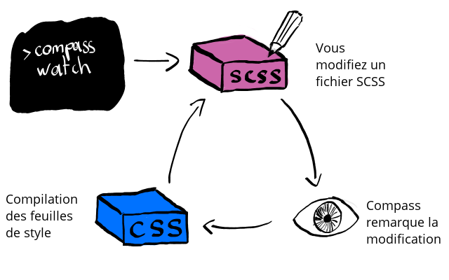

#Des feuilles de style stylées grâce à Sass et Compass
**Apprenez à mieux organiser vos feuilles de styles avec Sass**  
Lorsqu’on découvre comment sont faits les sites Web, on est souvent étonné
de voir que le contenu (HTML) est clairement séparé de la mise en page (CSS).
Et puis, assez vite, on ne peut plus s’en passer. C’est tellement pratique ! Mais
au bout d’un moment, nos fichiers CSS deviennent très longs, très très longs, et
on ne s’y retrouve plus. Alors, comment **mieux organiser son code**, comment le rendre
**plus maintenable** ?
#### En utilisant Sass, pardi !

Ce tutoriel s'adresse à toute personne très à l'aise avec HTML et CSS qui cherche un moyen de mieux gérer ses feuilles de styles.

[[attention]]
| Je ne suis en aucun cas un développeur front-end professionnel (disons plutôt un amateur très enthousiaste au sujet de Sass). Il est fort probable que quelques bourdes se soient glissées dans ce tutoriel. Si tel est le cas, pensez à me le signaler et je ferai mon possible pour corriger tout ça.

##Sass, un préprocesseur CSS
Au départ ce n'était qu'un petit jardin bien entretenu. Et puis, peu à peu, la forêt CSS s'est densifiée, les règles se sont multipliées, la jungle s'est installée. Vous êtes un jeune aventurier et vous avez peur de de vous lancer dans cette périlleuse expédition ? Il y a encore peu de temps, on vous aurait répondu de vous débrouiller. Mais aujourd'hui, une solution existe.

Un véritable produit miracle, un héro du vingt-et-unième siècle, une chimère devenue réalité ! On appelle cela… un préprocesseur CSS.

— Mais, c'est quoi un préprocesseur CSS ?  
— C'est tout le sujet de ce chapitre, ami lecteur…

###Un préprocesseur CSS
Commençons par regarder sur Wikipédia, qui nous donne une définition générale bien obscure…

> En informatique, un préprocesseur est un programme qui procède à
> des transformations sur un code source, avant l’étape de traduction
> proprement dite (compilation ou interprétation).
Source: Wikipédia

Essayons d'expliquer cela de manière plus simple. Un préprocesseur est un programme jouant le rôle d’une
moulinette : on lui donne du code source et, en échange, il génère un code modifié. On dit aussi que le préprocesseur compile du code.
Dans le cas d’un préprocesseur CSS comme Sass, on donne des fichiers écrits dans un langage spécifique à Sass et la moulinette génère des feuilles de style CSS qui pourront être comprises par un navigateur.

Ce langage spécifique est le *SCSS* (pour « Sassy CSS »). On retrouve dans ce nom les lettres CSS, car la syntaxe du langage SCSS se base sur celle de CSS. En fait, tout code CSS est compatible SCSS. Cela veut dire que tout travail en CSS est directement transposable en SCSS. Il suffit pour cela de changer l'extension du fichier pour `.scss`.

###À quoi ça sert ?
En fait, Sass ajoute aux CSS un ensemble de fonctionnalités qui permettent d'organiser de manière plus maintenable les feuilles de style. Sa devise  pourrait être "Don't Repeat Yourself" (ne vous répétez pas). Il ne s'agit donc pas de rajouter des propriétés, mais d'aider le développeur à y voir plus clair, à défricher son code (d'où ma métaphore de la forêt vierge, CQFD).

Comme tout est plus simple avec un exemple, je vous propose comme fil rouge à ce cours le site Web de *Citron Inc*, une petite entreprise spécialisée dans la production de limonades biologiques. Plutôt que de rire bêtement, vous feriez mieux d'observez cette maquette :

On remarque plusieurs choses :

+ Les mêmes couleurs (jaune, gris foncé, etc.) et les mêmes polices sont utilisées pour plusieurs éléments.
+ Les blocs représentant un produit du catalogue, une étape de fabrication ou un client partagent quelques propriétés. Il serait utile de "factoriser" toutes ces propriétés, pour que le fichier de travail soit moins long, sans pour autant qu'on perde en lisibilité.
+ Les boutons ont la plupart de leurs propriétés en commun (dimension et police, notament), mais pas toutes (les couleurs sont différentes). De plus, on peut facilement imaginer que des boutons similaires soient présents sur d'autres projets, et il serait fatigant de réinventer la roue à chaque fois.

Par ailleurs, certains problèmes d'organisation reviennent fréquemment :

+ Séparer les styles en plusieurs fichiers permet de mieux s'organiser en préprod, et facilite le recyclage de portions de code, mais demande plus de requêtes, donc plus de ressources en production.
+ En CSS il es fréquent de répéter plusieurs fois les mêmes sélecteurs. Dans notre exemple, on va ainsi cibler l'élément `header`, puis `header h1`, et enfin `header p`. À grande échelle, c'est plutôt barbant…

Sass apporte des solutions concrètes à chacun de ces problèmes, et à quelques autres. Il ne s'agit donc pas, comme certaines mauvaises publicités le laissent penser, du futur du CSS, mais plutôt d'un outil qui facilite la vie des codeurs.

Je finirais ce petit tour d'horizon en évoquant Compass, un framework pour Sass. Compass ajoute un ensemble de fonctionnalités (des codes prêts à l'emploi) couvrant un large panel : cela va du reset CSS à la création de sprites d'images, en passant par tout un tas de trucs utiles (listes horizontales, footer "scotché" au bas de la page, typographie des liens, etc.).

###En résumé
* Sass est un **préprocesseur CSS**, c’est-à-dire qu’il génère du CSS à partir de
fichiers `.scss` ;
* Utiliser un préprocesseur CSS permet d’**optimiser son code** et de moins se
répéter ;
* La syntaxe par défaut de Sass est le **SCSS** et tout code CSS est compatible avec cette syntaxe ;
* **Compass** est un framework pour Sass qui rajoute des fonctionnalités très
intéressantes (génération de sprite, support des propriétés CSS3 par tous
les navigateurs,...).

Voilà, nous arrivons à la fin de ce premier chapitre, j'espère qu'il vous a plu. Dans le prochain chapitre nous installerons Sass et vous créerez votre premier projet !

##Prise en main
— Bon, tout cela me semble très bien, par où on commence ?  
— Il me semble que l'installation serait un bon début, non ?

###Installation
Avant tout, chers lecteurs, il faut que vous disposiez d'un interpréteur Ruby. Ruby est le langage de programmation utilisé par les développeurs de Sass. Pour obtenir l'interpréteur Ruby, tout dépend du système d'exploitation. 
+ Sous Linux, l'installation se fait avec un gestionnaire de paquets comme `apt` ou `yum`.
+ Sous Mac OS X, vous pouvez sauter cette étape : Ruby est installé par défaut.
+ Sous Windows, vous pouvez télécharger l'installateur depuis [le site officiel](http://rubyinstaller.org/downloads/). Durant l'installation, pensez à cocher la case "Add Ruby executables to your PATH".

Maintenant, nous pouvons installer Sass et Compass avec `gem` (le gestionnaire de paquets inclus avec Ruby). Si c'est votre première utilisation de la ligne de commande, jeunes padawans, pas de panique : c'est d'une simplicité déconcertante. Lancez un terminal (pour Windows, il s'agit du programme `cmd` dans le menu Démarrer) et entrez : `gem install compass` (attention à ne pas oublier `sudo` sur les sysèmes Unix).

[[erreur]]
| Si Windows n'arrive pas à trouver gem, c'est peut-être que vous n'avez pas coché durant l'installation la case "Add Ruby executables to your PATH".

Pourquoi installe-t-on Compass directement ? En fait, `gem` sait que Compass a besoin de Sass pour fonctionner, et installe donc Compass et Sass. Ce qui veut dire que l'installation est terminée !

###Notre projet fil rouge
Il ne nous reste plus qu'à créer un projet qui nous servira de test durant le tutoriel. De nouveau, nous avons besoin de la console. Ouvrez un terminal dans votre dossier personnel (dans l'explorateur Windows 7, il est possible de choisir "Ouvrir une fenêtre de commandes ici" en effectuant un ||Maj|| + Clic-droit).

Pour créer un projet Compass, il y a  une commande à retenir : `compass create tuto-sass`. Cette commande va créer un dossier nommé `tuto-sass`. Celui ci contient par défaut :

 * **sass** : c'est dans ce dossier que nous mettrons nos fichiers `.scss` ;
 * **stylesheets** : c'est dans ce dossier que Sass générera les fichiers `.css` ;
 * **.sass-cache** : c'est un dossier utile à Sass lors de la compilation, on n'y touchera pas;
 * **config.rb** : ce fichier sert à configurer Compass, nous le modifierons en temps voulu.

Maintenant, revenons à notre fil rouge, rappelez-vous, le site de limonade. Je vais vous fournir son code comme exemple tout au long de ce cours. Nous partirons donc d'un gros fichier CSS (et de la page HTML qui va avec) et nous allons chercher à le rendre le plus lisible, compréhensible et maintenable possible avec l'aide de Sass. Vous pouvez récupérer l'ensemble du projet sur [Github](https://github.com/Matouche/CitronInc).

Vous pouvez enregistrer le dossier `img` et la page HTML dans le dossier `tuto-sass` et je vous invite à coller le contenu de la feuille de style dans le fichier `sass/screen.scss` (notez bien l'extension `.scss`).

Voilà, nous sommes prêts pour commencer ! Si vous préférez démarrer directement avec un de vos projets actuels plutôt que de prendre mon exemple, n'hésitez pas : vous ne devriez pas avoir trop de mal à appliquer ce que je vais vous montrer.

###La compilation
Il reste encore à générer la feuille de style `stylesheets/screen.css`, c'est-à-dire à compiler `sass/screen.scss`). Vu que nous avons créé notre projet avec la commande `compass`, nous pouvons aussi le compiler avec.

Tout d'abord, plaçez-vous  à l'intérieur du dossier `tuto-sass` en ligne de commande, avec la commande `cd` (ou, sous Windows 7+, comme vu dans le chapitre précédent).

Entrez la commande `compass watch` (à retenir !). Celle-ci va indiquer à Compass qu'il doit *écouter* le projet. Désormais, s'il remarque un changement, il lancera la compilation des feuilles de style concernées. Vous n'avez donc plus à vous soucier de la compilation, puisqu'elle est effectuée de manière transparente à chaque sauvegarde.

Compass devrait justement avoir remarqué les changements que nous avons appliqués au fichier `screen.scss`. Normalement, il indique :

    modified sass/screen.scss
        write stylesheets/screen.css
        
Cela signifie que le fichier `screen.css` a été généré, comme vous pouvez aller le vérifier dans le dossier `stylesheets`.

###En résumé
* Pour **créer un projet**, on utilise la commande `compass create <nom-du-projet>`.
* Avec la commande `compass watch`, on demande à Compass de **compiler automatiquement** nos fichiers `.scss` en langage CSS à chaque modification.

Dans le prochain chapitre, nous nous intéresserons à un premier concept clef de Sass, l'imbrication de règles.

##L'imbrication
— Quand est-ce qu'on commence ?  
— Tout de suite ! On va va mettre les mains dans le cambouis et imbriquer des règles…  
— Comme des Légos ?  
— Hum, disons plutôt comme des poupées russes, mais de toute façon, vous allez pouvoir vous faire une idée rapidement.

###L'imbrication, pourquoi faire ?
L'*imbrication de règles* est une fonctionnalité fondamentale de Sass. Comme vous aller le voir, s'inscrit vraiment dans le principe « Don't Repeat Yourself ». Pour commencer, observons cet extrait de notre feuille de style :

    :::scss
    blockquote{
        font-style: italic;
    }
    blockquote:before, blockquote:after{
        content: '"';
    }
    .quote{
        text-align: right;
        margin: 1rem 0;
    }
    .quote blockquote{
        font-size: 3rem;
        line-height: 1em;
    }
    .quote figcaption{
        font-family: "Grand Hotel", serif;
        font-size : 1.2rem;
        margin-top: 1rem;
    }
    .quote figcaption:before{
        content: '\2012  ';
    }

On remarque que `blockquote`, `.quote` et `figcaption` sont répétés plusieurs fois. Ce n'est pas encore trop rébarbatif à cette échelle là, mais ça l'est au niveau de la feuille de style en entier : on n'a pas forcément envie de répéter plusieurs fois les mêmes sélecteurs. Avec Sass, les règles concernant `.quote` peut être écrit de la manière suivante en utilisant l'imbrication de règles :

    :::scss
    .quote{
        text-align: right;
        margin: 1rem 0;
        blockquote{
            font-size: 3rem;
            line-height: 1em;
        }
        figcaption{
            font-family: "Grand Hotel", serif;
            font-size : 1.2rem;
            margin-top: 1rem;
        }
        figcaption:before{
            content: '\2012  ';
        }
    } 

Avec l'imbrication, nous n'avons écrit `.quote` qu'une seule fois et nous avons mis les blocs `blockquote`, `figcaption` et `figcaption:before` *à l'intérieur* du bloc `.quote`. Sass comprend lors de la compilation que les règles ne doivent concerner que les éléments `<blockquote>` et `<figcaption>` situées à l'intérieur d'une élément de classe `.quote`. On obtient bien la même chose qu'avec le code précédent. Cependant, vous remarquez que l'on a regroupé toutes les règles concernant un module (la citation) dans un même bloc. Ainsi, le code est plus lisible, car il est mieux *organisé*.

On peut aussi imbriquer des propriétés CSS. Cela peut être utile pour regrouper les propriétés d'une même catégorie à l'intérieur d'un bloc. Par exemple, nous pouvons mettre dans un même bloc les propriétés `font-size` et `font-family`, comme ceci (faites bien attention au deux-points après `font`) :

    :::scss
    figcaption{
        font: {
            family: "Grand Hotel", serif;
            size: 1.2rem;
        }
        margin-top: 1rem;
    }

Voilà pour le principe de base de l'imbrication. Cependant, on peut faire encore mieux…

###Cas particuliers
####La référence au parent
On n'a pas encore réussi à imbriquer le sélecteur `figcaption:before`. Vous pensez que le code suivant marchera ?

    :::scss hl_lines="7"
    figcaption{
        font: {
            family: "Grand Hotel", serif;
            size: 1.2rem;
        }
        margin-top: 1rem;
        :before{
            content: '\2012  ';
        }
    }

En réalité, on obtiendra le sélecteur `figcaption :before` (avec une espace) qui ne veut rien dire. Pour corriger cela, on va utiliser le sélecteur `&`, qui *fait référence au parent*. Ainsi, ce code fonctionnera :

    :::scss hl_lines="7"
    figcaption{
        font: {
            family: "Grand Hotel", serif;
            size: 1.2rem;
        }
        margin-top: 1rem;
        &:before{
            content: '\2012  ';
        }
    }
    
Que s'est-il passé ? Avec le sélecteur `&` (l'esperluette), on a indiqué à Sass où il devait insérer le sélecteur du bloc parent. Dans notre cas, comme il n'y a pas d'espace entre `&` et `:before`, il n'y en aura pas après compilation entre `figcaption`et le pseudo-élément.

On peut faire de même avec `blockquote` :

    :::scss
    blockquote{
        font-style: italic;
        &:before, &:after{
            content: '"';
        }
    }
    
Il est aussi possible de s'en servir avec une *pseudo-classe* (`&:hover` sélectionne l'élément parent au survol) ou même à la fin d'un sélecteur (`section &` sélectionne l'élément parent lorsqu'il est contenu dans une balise `<section>`). Toujours moins de répétitions, et toujours plus d'imbrications qui rendent le code plus lisible. :)

####Les media-queries
Depuis quelque temps et la démocratisation du Responsive Web Design (RWD pour les intimes), les media-queries ont le vent en poupe. Justement, saviez-vous que Sass permet d'imbriquer la directive `@media` ? Interessons-nous à cet extrait de notre exemple :

    :::scss hl_lines="4"
    #description{
        max-width:22rem;
    }
    @media all and (min-width: 740px){
        #description{
            max-width:48%;
        }
    }
    
Il est possible d'imbriquer le bloc `@media` à l'intérieur du bloc `#description`. L'intérêt est encore un gain de clarté, puisque l'on regroupe toutes les règles concernant un module (`#description`) dans un même bloc :

    :::scss hl_lines="3"
    #description{
        max-width:22rem;
        @media all and (min-width: 740px){
            max-width:48%;
        }
    }
    
Voilà, pas grand chose d'autre à dire là-dessus, même si on reparlera un peu des media-queries dans le prochain chapitre.

###Bonne pratique : *The Inception Rule*
— Ça y est ? On a fini ?  
— Pas si vite, chenapans ! Il reste une bonne pratique !

Nous sommes en 2013 et vous écoutez France Inter (oui oui, France Inter !) quand tout à coup résonne ce message à caractère informatif émanant du ministère de la Santé :

>Les antibiotiques : utilisés à tord, ils deviendront moins fort.

Source: Marisol Touraine

C'est pareil pour Sass, et en particulier pour l'imbrication. En effet, si l'imbrication est un outil puissant, il ne faut pas pour autant en abuser, au risque de provoquer une pagaille inimaginable. Vous pourriez être tentés de reproduire dans la feuille de style la structure de la page HTML, un peu comme ceci :

    :::scss
    html{
        ...
        body{
            ...
            header{
                #hgroup{
                    ...
                    h1{...}
                    h2{...}
                }
                #search{
                    ...
                    input{...}
                    button{
                    ...
                        &::after{...}
                    }
                }
            }
            #presentation{...}
        }
    }

Sauf que… **c'est mal !** Essayez d'imaginer quels sélecteurs seront présents après la compilation :

    :::css
    html body header #hgroup #search button::after{
        ...
    }

Beurk. Une telle méthode pose deux problèmes. Le premier, c'est que l'on perd en partie le principe de la cascade : les sélecteurs sont trop spécifiques, et une modification, même peu importante du HTML risque d'imposer une modification de la feuille de style. Pas franchement maintenable. :( Le second, c'est que, tout bêtement, le fichier `.css` sera inutilement lourd, ce qui est embêtant pour le serveur comme pour les visiteurs.

C'est là qu'intervient ce que l'on appelle *« The Inception Rule »*. La règle est la suivante : *n'imbriquez pas plus de quatre niveaux différents*. Cette règle peut vous sembler contraignante, mais je vous invite à la suivre. Elle vous empêchera de faire des feuilles de style trop spécifiques, et elles seront donc plus facilement maintenables. On peut parfois dépasser cette limite, comme lorsqu'on ajoute de l'intéraction (avec `:hover` par exemple). Essayez quand même le plus possible de ne pas trop allonger vos sélecteurs. Il y a souvent moyen de faire plus court (quitte à utiliser des id et des classes).

###En résumé
 * On peut éviter d'écrire plusieurs fois les mêmes sélecteurs, grâce à l'**imbrication**.
 * Lors de l'imbrication, pour **faire référence au bloc parent**, on utilise le sélecteur `&`.
 * On peut **imbriquer la directive `@media`** pour mieux organiser son code.
 * Il ne vaut mieux pas dépasser **quatre niveaux d'imbrication**, c'est *The Inception Rule*.
 
###Pour s'entraîner
Je vous invite à trouver tous les endroits où il est possible d'utiliser l'imbrication dans notre exemple, plu particulièrement en ce qui concerne l'élément `#search`, qui regroupe vraiment tout ce que nous venons de voir (esperluette et media-queries compris). La correction est [ici](https://github.com/Matouche/CitronInc/blob/master/corrections/imbrication.scss).
 

Dans le prochain chapitre, nous ferons un sort aux variables, de petites bestioles bien pratiques, héritées des langages de programmation.

##Les variables
— Les variables, c'est pas un concept de Mathématiques au départ ?  
— Euh… Non, ne fuyez pas ! C'est très simple et extrêmement utile.  
— Qu'est-ce que c'est, alors ?  
— On pourrait les comparer à des enveloppes… Enfin, bref, vous verrez bien !

###Les variables, pourquoi faire ?
Vous avez sans doute remarqué que, dans un design, certaines valeurs reviennent souvent. Si on observe de près notre fil rouge, on peut retrouver plusieurs fois les mêmes couleurs et polices :

Maintenant, imaginez que vous souhaitez changer une de ces valeurs. Vous devez alors effectuer un rechercher-remplacer dans toute votre feuille de style. Mais il y a bien plus simple, vous pouvez utiliser une **variable** !

Une variable, c'est un peu comme une enveloppe. On stocke à l'intérieur une valeur (par exemple, la couleur `#ff0`) et on met une étiquette dessus (c'est le nom de la variable).

###Les différents types de données
###L'interpolation

##La directive @import
###Importer des feuilles de styles
###Bonne pratique : les feuilles partielles
###!default
###En résumé

##Les mixins (1/2)
###Un mixin, pourquoi faire ?
###Inclure un mixin
###Les arguments
###En résumé

##Les mixins (2/2)
###Arguments nommés
###Listes d'arguments
###Passer un bloc de contenu à un mixins
###En résumé